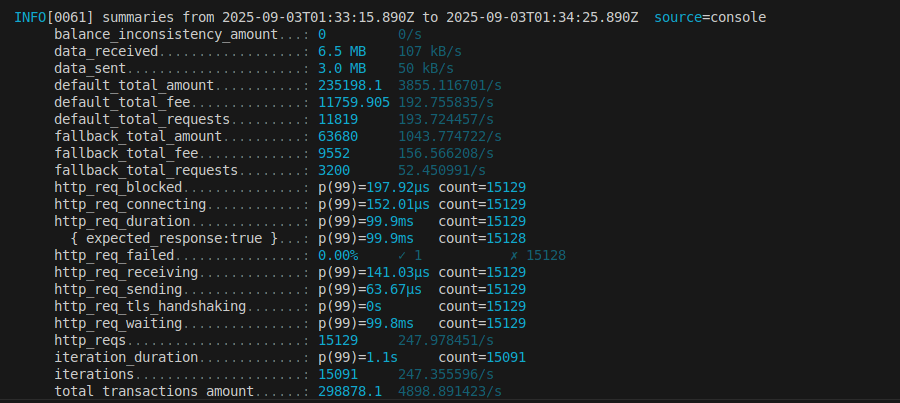

# Payment Processor API - Rinha de Backend 2025

High-performance payment processing API built with Go for the [Rinha de Backend 2025](https://github.com/zanfranceschi/rinha-de-backend-2025) challenge. Optimized for high throughput and low latency using Redis Streams and PostgreSQL.

## Architecture

- **API Layer**: 2 Go instances behind Nginx load balancer
- **Queue**: Redis Streams for reliable message delivery
- **Storage**: PostgreSQL 17 for transaction persistence
- **Load Balancer**: Nginx with health checks
- **Workers**: Dynamic worker pool for payment processing

### Key Features

- Redis Streams for reliable message queuing
- Smart routing between payment processors
- Automatic service health monitoring
- Graceful failover between services
- Optimized PostgreSQL configuration
- Connection pooling and reuse

## Performance

Designed to handle high concurrency with minimal resource usage:
- 250+ transactions/second
- Memory usage = 350MB total
- CPU usage = 1.5 cores total




## Setup & Running

1. **Clone repository:**
```bash
git clone <repository-url>
cd src
```

2. **Build Docker image:**
```bash
docker build -t go-app .
```

3. **Start payment processor services:**
```bash
cd ../payment-processor
docker-compose up -d
```

4. **Start the application:**
```bash
cd ../src
docker-compose up -d
```

## Testing

Navigate to rinha-test folder and run:
```bash
k6 run rinha.js
```

## Resource Limits

All services respect challenge limits:
- Total CPU: 1.5 cores
- Total Memory: 350MB
  - PostgreSQL: 200MB
  - Redis: 75MB
  - Each API: 30MB
  - Nginx: 15MB

## Container Architecture

```
                 ┌─────────┐
                 │  Nginx  │
                 └────┬────┘
              ┌───────┴───────┐
         ┌────▼────┐    ┌────▼────┐
         │  API 1  │    │  API 2  │
         └────┬────┘    └────┬────┘
              │             │
        ┌─────┴─────────────┴──────┐
        │          Redis           │
        └─────┬─────────────┬──────┘
              │             │
    ┌─────────┴───┐   ┌────┴──────────┐
    │ PostgreSQL  │   │ Payment Procs  │
    └─────────────┘   └───────────────┘
```

## Environment Variables

```env
DB_HOST=postgres
DB_PORT=5432
DB_NAME=rinha
DB_USER=postgres
DB_PASSWORD=postgres
REDIS_HOST=redis
REDIS_PORT=6379
DEFAULT_HEALTH_CHECK_URL=http://payment-processor-default:8080/payments/service-health
FALLBACK_HEALTH_CHECK_URL=http://payment-processor-fallback:8080/payments/service-health
```

## API Endpoints

### POST /payments
Create new payment transaction

**Request:**
```json
{
  "amount": 100.50,
  "correlationId": "123e4567-e89b-12d3-a456-426614174000"
}
```

### GET /payments-summary
Get payment processing summary

**Response:**
```json
{
  "total_amount": 1000.00,
  "total_fee": 50.00,
  "total_count": 10
}
```

## Technologies

- Go 1.24
- PostgreSQL 17
- Redis 7
- Nginx
- Docker & Docker Compose